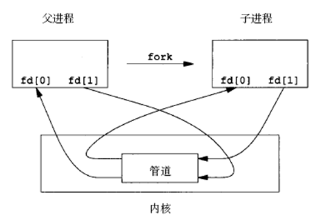

# Linux主要的通信方式
* 管道(pipe)和有名管道(fifo)
* 信号(signal)
* 消息队列
* 共享内存
* 信号量
* 套接字(socket)

## 管道
1. 管道是单向的、先进先出的，它把一个进程的输出和另一个进程的输入连接在一起。一个进程（写进程）在管道的尾部写入数据，另一个进程（读进程）从管道的头部读出数据。
2. 数据被一个进程读出后，将从管道中删除。其它读进程将不能再读到这些数据。管道提供了简单的流控制机制，进程试图读空管道时，进程将阻塞。同样，管道已经满时，进程再试图向管道写入数据，进程将阻塞。
3. 管道包括无名管道和命名管道，前者用于父进程和子进程间的通信，后者可用于运行于同一系统中任意两个进程间的通信。

### 管道的创建
1. 无名管道由pipe()函数创建：
```c++
int pipe(int filedis[2]);
```
2. 当一个管道建立时，它会创建两个文件描述符：filedis[0]用于读管道，filedis[1]用于写管道。
### 管道关闭
1. 关闭管道只需要将这两个文件描述符关闭即可。可以使用普通的close函数逐个关闭。

### 无名管道使用特点
* 它只能用于具有亲缘关系的进程间通信(如父子进程)
* 它是半双工的通信模式，具有固定的读端和写端
* 管道可以看做是一种特殊的文件，对于它的读写可以使用普通的read和write等函数。但它不是普通的文件，只存在于内核的内存空间中。

无名管道创建实例：
```C++
#include <unistd.h>
#include <errno.h>
#include <stdio.h>
#include <stdlib.h>
int main()
{
	int pipe_fd[2];
	if(pipe(pipe_fd)<0)
	{
		printf("pipe create error\n");
		return -1;
	}
	else
		printf("pipe create success\n");
	close(pipe_fd[0]);
	close(pipe_fd[1]);
}
```

### 无名管道的读写
* 管道用于不同进程间通信，通常先创建一个管道，再通过fork函数创建一个子进程，该子进程会继承父进程所创建的管道。



## 命名管道
* 命名管道和无名管道基本相同，但也有不同点：无名管道只能有父子进程使用；但是通过命名管道，不相关的进程也能交换数据。
### 命名管道的创建
```c++
#include <sys/types.h>
#include <sys/stat.h>
int mkfifo(const char* pathname,mode_t mode)
//pathname:FIFO文件名
//mode：属性（见文件操作章节）
```
### FIFO出错信息
* EACCES (无存取权限)
* EEXIST (指定文件不存在)
* ENAMETOOLONG (路径名太长)
* ENOENT (包含的目录不存在)
* ENOSPC (文件系统剩余空间不足)
* ENOTDIR (文件路径无效)
* EROFS (指定的文件存在于只读文件系统中)
