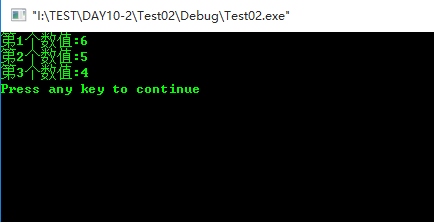
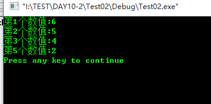

# break和continue的区别和作用

* break和continue都是用来控制循环结构的，主要是停止循环。

## break
* break语句终止循环

示例代码：
```
#include <iostream>
using namespace std;
int main()
{
     int iarray[5]={6,5,4,3,2};
     for(int i=0;i<5;i++)
     {
          if (i==3)
               break;
          printf("第%d个数值:%d\n",i+1,iarray[i]);
     }
     return 0;
}
```
运行结果：

## continue
* continue语句结束本次循环，进入下一次循环

示例代码：
```
#include <iostream>
using namespace std;
int main()
{
     int iarray[5]={6,5,4,3,2};
     for(int i=0;i<5;i++)
     {
          if (i==3)
              continue;
          printf("第%d个数值:%d\n",i+1,iarray[i]);
     }
     return 0;
}
```
运行结果：


