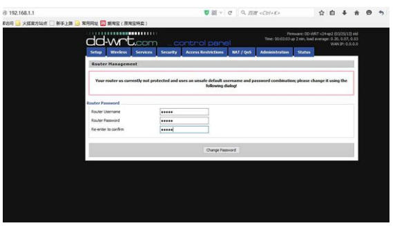
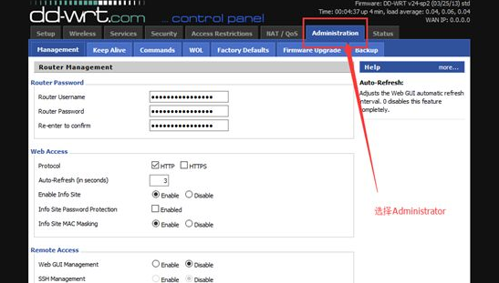
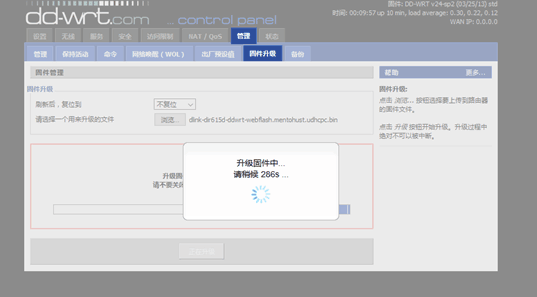
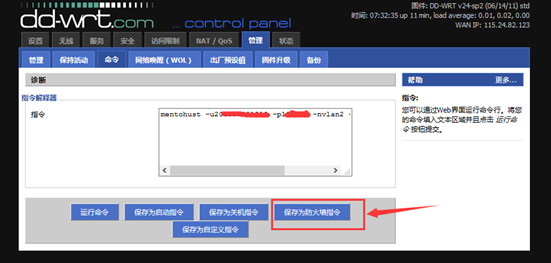

## 简介
### 原理简介
路由器相当于一台小型计算机，可手动刷入linux系统（网友制作的dd-wrt和openwrt是两种流传较广的linux系统），并在这个系统里运行锐捷拨号程序。
### 路由器简介
1. 目前刷过2种型号的路由器，分别是TP-Link和D-Link。
2. 这次先刷一个dlink的路由器，型号是DIR-615，D4版本的（这个版本的好处是dd-wrt和openwrt两个固件都可以刷），经过测试，刷dd-wrt的路由器网速明显高于刷openwrt的但并不是所有路由器都支持刷机的，刷不成就成砖了，还得买一条TTL线进行修复。
3. dd-wrt支持的路由器列表：http://www.dd-wrt.com/site/support/router-database
4. openwrt支持的路由器列表：http://wiki.openwrt.org/toh/start

## 刷机教程
1. 修改电脑的ip地址
```
IP地址： 192.168.0.25
子网掩码： 255.255.255.0
```


2. 刷dd-wrt固件到路由器里

见下图，是D-Link路由器照片，先别通电，把校园网主网线接在路由器的internet口，电脑的网线接在路由器剩下4个口其中一个就可以了。此时先用东西抵住路由器的复位键（RESET），然后通电，会看到路由器电源灯在闪烁


3. 在浏览器网址输入192.168.0.1，并把固件放入后点击升级后等待就可以了。
* 固件链接（D-Link信号的DIR-615的D4版本），不是这个型号的不要乱刷，否则会成砖的
dd-wrt固件链接：http://pan.baidu.com/s/1mgpfX0W


4. 第一个固件刷入完毕，把电脑IP改回自动获取


5. 这一步进行汉化配置，浏览器网址输入192.168.1.1后弹出路由器登陆界面，3个都改成admin（这个随意），然后选择Administrator，往下拉会看到Language Select选项，进行配置后保存即可，然后界面就是简体中文了，见图：





6. 这一步刷入第二个固件来支持锐捷拨号，登陆192.168.1.1，选择“管理”->“固件”->"固件升级"，放入固件点击“升级”，接着等待就可以了，见图：





7. 到此所以固件升级完毕，进行配置啦（嘿嘿），进入192.168.1.1，选“设置”下拉找到Secure Shell后启用SSHd，再到“管理”->"远程管理"，启用“SSH管理”和“Telnet管理”，保存。


8. 学校的IP是动态IP，所以很省事，不用再配置路由器了，静态IP要进入管理界面设置ip、子网掩码、网关、DNS服务器等。

* 点击电脑左下角的“开始”-“运行”，输入“cmd”，弹出一个dos窗口。
* 输入 telnet 192.168.1.1 连接路由器（注意此时有可能提示“无telnet指令”或“不是内部或者外部命令”。解决方法：在控制面板“程序和功能”页面左边的“打开或关闭windows功能”，勾选telnet服务器和telnet客户端）
* 接下来需要输入账号：root和密码：admin，按回车

* 查看是用哪个网卡来拨号，输入ifconfig后，查看到我用的是网卡2（就2个网卡，vlan2和vlan1）

* 确定了是用哪个网卡后就要输入指令了，咱们学校是动态IP，输入如下指令：
```
mentohust -u用户名 -p密码 -n网卡名 -a1 -d2 -v版本号
如：mentohust –u1234 –p1234 -nvlan2 -a1 -d2 -v6.02
（版本号是锐捷版本，如-v6.02）
```
* 按下回车后会看到下图：表明开启成功，这时路由器就有网了

* 再进入路由器的设置界面（在浏览器地址栏输入“192.168.1.1”用户名密码admin），
进去选项卡“管理”--“命令”，输入上一步的命令,点击“保存为防火墙指令”
```
mentohust –u1234 –p1234 -nvlan2 -a1 -d2 -v6.02
```



到此所有配置完毕，以后就不用管理路由器了，畅享无线吧
